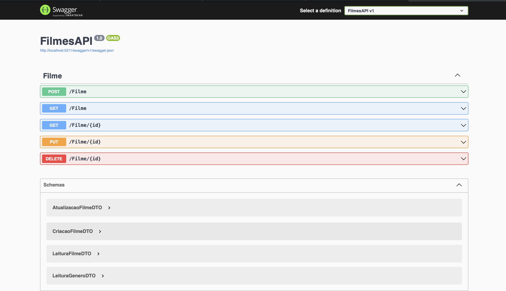

# FilmesAPI 🎬

API REST desenvolvida em C# com .NET Core para gerenciamento de um catálogo de filmes. O projeto utiliza Entity Framework Core para persistência de dados e inclui relacionamentos complexos entre entidades.

## 📸 Demonstração (localhost)

## 🔨 Funcionalidades

- **CRUD Completo de Filmes:**
  - Cadastro com validação de dados.
  - Leitura com paginação (`Skip` e `Take`).
  - Atualização com gerenciamento de **Gêneros (Relacionamento N:N)**.
  - Exclusão (com tratamento de integridade referencial).
- **Relacionamento Muitos-para-Muitos:** Vínculo entre Filmes e Gêneros.
- **Pattern DTO:** Separação entre modelos de domínio e objetos de transferência.
- **AutoMapper:** Mapeamento automático entre Entidades e DTOs.

## 🛠️ Tecnologias Utilizadas

- C#
- .NET 6+ (ASP.NET Core)
- Entity Framework Core
- Banco de Dados (MySQL)
- Swagger (para documentação e testes)
- AutoMapper

## 🚀 Próximos Passos (Roadmap)

- [x] **Async/Await:** Refatorar os Controllers para chamadas assíncronas.
- [ ] **Filtros de Busca:** Buscar filmes por nome ou gênero específico.
- [ ] **Autenticação:** Proteger a API com JWT.

## 📝 Como rodar

1. Clone o repositório.
2. Configure a string de conexão no `appsettings.json`.
3. Execute as migrations: `dotnet ef database update`.
4. Rode o projeto: `dotnet run`.

## 👩🏻‍💻 Desenvolvido por 

[**Graciane**](mailto:graciane.dev@gmail.com)