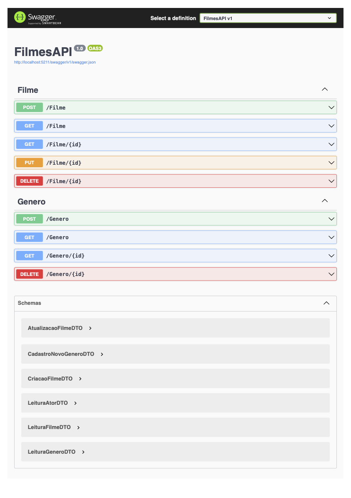

# FilmesAPI 🎬

API REST desenvolvida em C# com .NET Core para gerenciamento de um catálogo de filmes. O projeto utiliza Entity Framework Core para persistência de dados e inclui relacionamentos complexos entre entidades.

## 📸 Demonstração (localhost)

## 🔨 Funcionalidades

- **CRUD Completo de Filmes:**
  - Cadastro com validação de dados.
  - Leitura com paginação (`Skip` e `Take`).
  - **Filtros Avançados:** Busca dinâmica por Nome do Filme, Gênero, Ator, Ano e Ordenação customizada.
  - Atualização com gerenciamento de relacionamentos.
- **Gestão de Gêneros:** Controller dedicado para criar, listar e deletar gêneros.
- **Relacionamento Muitos-para-Muitos:** - Vínculo entre Filmes e Gêneros. DER disponível na pasta [docs](docs).
  - Vínculo entre Filmes e Atores (Elenco).
- **Pattern DTO:** Separação estrita entre modelos de domínio (Entity) e objetos de transferência (DTO).
- **AutoMapper:** Mapeamento automático inteligente, incluindo projeção de listas aninhadas (Ex: Filmes trazem seus Gêneros e Atores).

## 🛠️ Tecnologias Utilizadas

- C#
- .NET 6+ (ASP.NET Core)
- Entity Framework Core
- Banco de Dados (MySQL)
- Swagger (Documentação)
- AutoMapper
- LINQ (Consultas complexas)

## 🚀 Próximos Passos (Roadmap)

- [x] **Async/Await:** Refatorar os Controllers para chamadas assíncronas.
- [x] **Filtros de Busca:** Buscar filmes por nome, gênero, ator ou ano.
- [x] **Refatoração:** Criação do GeneroController independente.
- [ ] **Paginação Avançada:** Retornar metadados (total de páginas, itens por página).
- [ ] **Autenticação:** Proteger a API com JWT.

## 📝 Como rodar

1. Clone o repositório.
2. Configure a string de conexão no `appsettings.json`.
3. Execute as migrations: `dotnet ef database update`.
4. Rode o projeto: `dotnet run`.

## 👩🏻‍💻 Desenvolvido por 

[**Graciane**](mailto:graciane.dev@gmail.com)